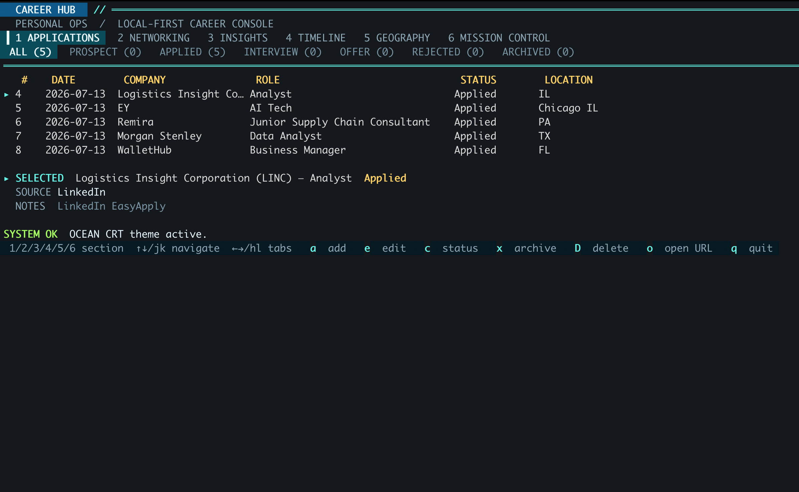
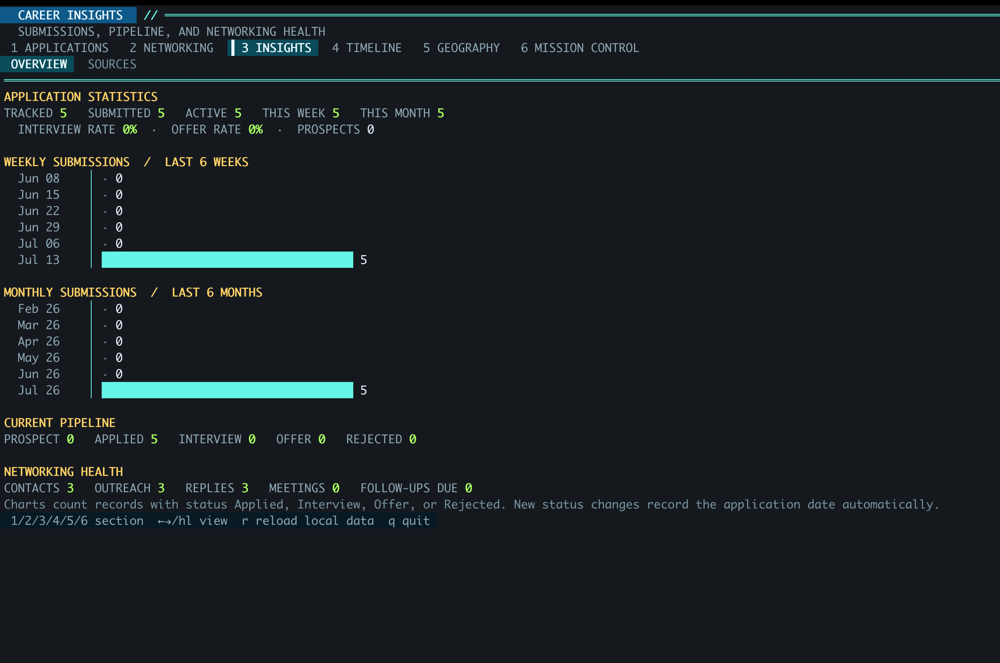
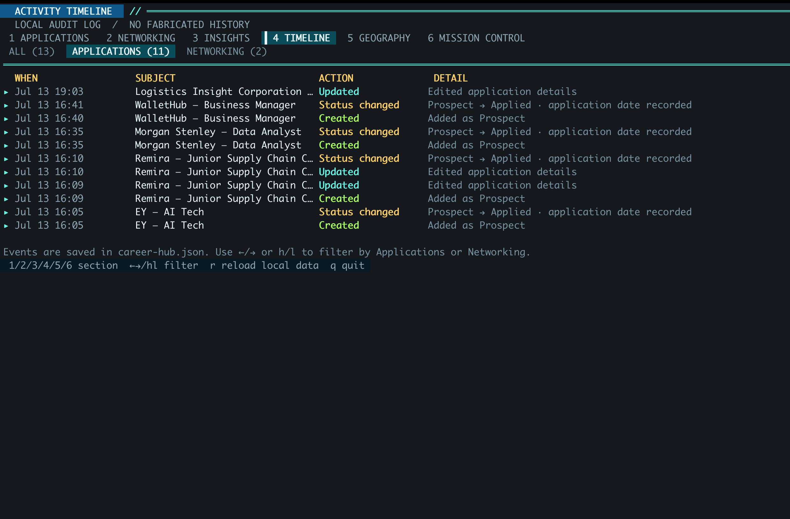
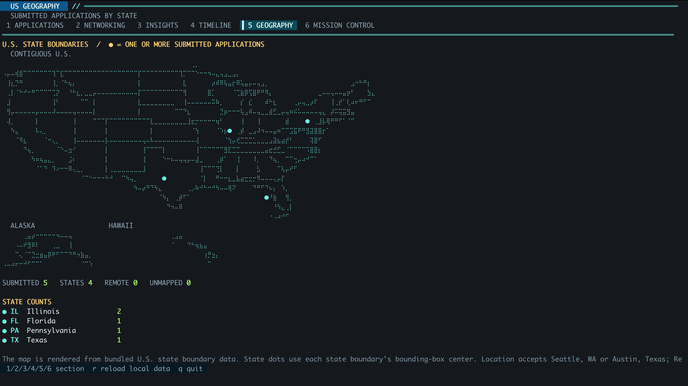
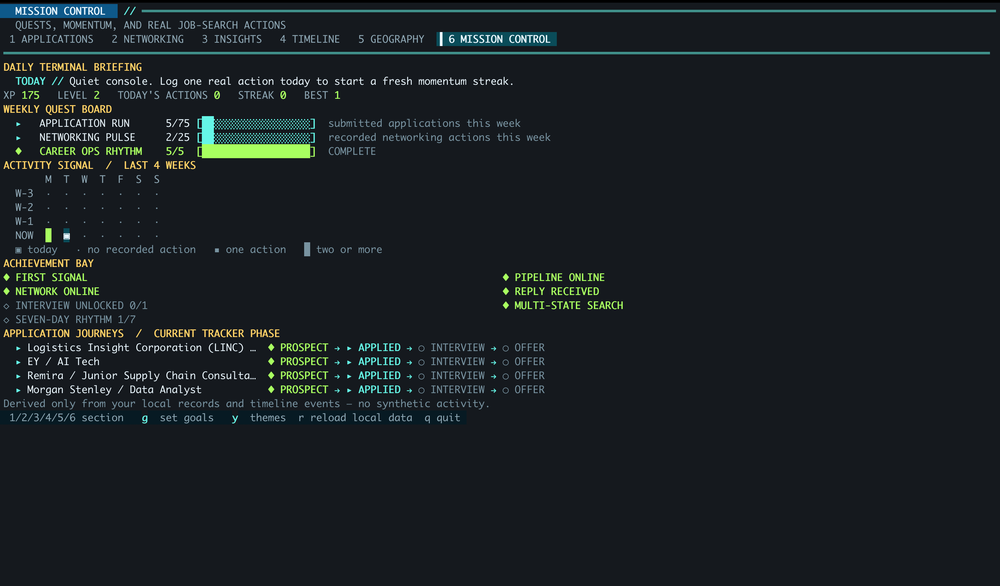

# Career Hub

<p align="center">
  <strong>A local-first terminal dashboard for running a thoughtful job search.</strong><br />
  Applications, networking, momentum, source attribution, activity history, and U.S. geography — in one private JSON-backed console.
</p>

<p align="center">
  
  
  
</p>



Career Hub is intentionally small and private. It does **not** scan job boards,
call an AI model, collect accounts, send applications, or upload your data. It
is a fast terminal workspace for the job-search work that benefits from clear,
accurate tracking.

## Why Career Hub?

Most job trackers either live in a spreadsheet or ask you to hand over your
data. Career Hub keeps the useful parts local:

- Track applications from Prospect through Offer.
- Keep a lightweight networking CRM with follow-up dates and context.
- See weekly/monthly submission momentum, pipeline conversion, and networking health.
- Attribute results to channels such as LinkedIn, referrals, recruiters, and company sites.
- Maintain a local audit timeline of the changes you actually make.
- Map submitted roles by U.S. state with real state-boundary geometry.
- Set weekly goals and view a non-fictional Mission Control layer: quests,
  streaks, heatmap, XP, achievements, and application journeys.
- Enjoy a high-contrast retro terminal interface with optional milestone-based themes.

## Screens

| Applications | Insights |
| --- | --- |
|  |  |

| Activity timeline | U.S. geography |
| --- | --- |
|  |  |

| Mission Control |
| --- |
|  |

## Quick start

### Prerequisite

Install [Go 1.24 or newer](https://go.dev/dl/). No database, account, browser
extension, API key, or Node.js installation is required.

### Clone and run

```bash
git clone https://github.com/brianchen002/career-hub.git
cd career-hub
go run .
```

Career Hub starts with an empty local `career-hub.json` file when it first
saves data. That file is ignored by Git, so your personal tracker never becomes
part of a commit by accident.

### Build a local executable

```bash
go build -o career-hub .
./career-hub
```

On macOS, `Open Career Hub.command` builds the executable if needed and starts
the TUI from its own folder. You can double-click it in Finder or open it from
your preferred terminal.

### Load fictional demo data (optional)

```bash
cp career-hub.example.json career-hub.json
go run .
```

The sample contains fictional records only. Replace it with your own data at
any time, or use a separate data file:

```bash
./career-hub --data my-search.json
```

## How to use it

### 1. Add applications

Press `1` for **Applications**, then `a` to add a role. Company and role are
required. Add a city/state (for example `Chicago, IL`) to place the role on the
map; use `Remote, US` for remote work. The optional **Source** field enables
channel attribution later.

Change a record with `c` rather than manually editing the JSON. Moving an
application from Prospect to `Applied`, `Interview`, `Offer`, or `Rejected`
records an application date automatically.

### 2. Keep networking in the same console

Press `2` for **Networking** and `a` to add a person, their company, context,
last-contact date, and next follow-up. Statuses are:

`To Reach Out` → `Sent` → `Replied` → `Meeting` → `Nurture`.

### 3. Review the signal, not just the count

- Press `3` for **Insights**. Use `←` / `→` (or `h` / `l`) for Overview and
  Sources.
- Press `4` for the **Timeline**. It records creates, edits, status changes,
  archives, and permanent deletions after you start using Career Hub.
- Press `5` for **Geography**. State markers represent submitted applications
  only; Remote and unrecognized locations are kept separate.
- Press `6` for **Mission Control**. Press `g` to set your weekly goals and
  `y` to select an unlocked terminal palette.

## Keyboard reference

| Key | Action |
| --- | --- |
| `1`–`6` | Open Applications, Networking, Insights, Timeline, Geography, or Mission Control |
| `↑` / `↓` or `j` / `k` | Move selection |
| `←` / `→` or `h` / `l` | Switch status/filter tabs where available |
| `a` | Add an application or networking contact |
| `e` | Edit selected record |
| `c` | Change selected record status |
| `x` | Archive selected record |
| `D` | Permanently delete selected record (confirmation required) |
| `o` | Open saved job or profile URL in the default browser |
| `g` | Set weekly goals in Mission Control |
| `y` | Choose an unlocked terminal theme in Mission Control |
| `r` | Reload the local JSON file |
| `q` / `Ctrl+C` | Quit |

Inside an add/edit form, use `Tab`, `Enter`, `↑`, or `↓` to move fields,
`Ctrl+S` to save, and `Esc` to cancel.

## Data and privacy

All mutable data lives in one local JSON file, `career-hub.json`. It contains
applications, networking contacts, goals, activities, and theme unlocks. It is
not read by the program over the network and is listed in `.gitignore`.

The program ships with public U.S. state geometry in
`assets/us-states-10m.json`, used solely to render the terminal map. It does
not make a network request to draw the map.

Recommended backup: copy your `career-hub.json` to an encrypted or trusted
backup location. Do not commit it to a public repository.

## Steamworks signals and themes

The optional presentation layer never fabricates activity. Every signal is
triggered by a real status change or saved record:

1. **Steamworks boot sequence** — a roughly five-second, skip-anytime 1980s
   brass/amber terminal start-up screen.
2. **New Territory Signal** — first submitted application in a U.S. state.
3. **Pipeline Transmission** — reach the week's application goal.
4. **Inbound Signal Detected** — record the first contact reply.
5. **Offer Protocol** — record the first offer.
6. **Visual Module Unlocked** — unlock terminal palettes by milestones.

Available palettes are Ocean CRT (default), Amber Foundry, Phosphor Vector,
and Ruby Synthwave. A theme only changes color; it never changes data.

## Development

```bash
go test ./...
go build -o career-hub .
```

The application is written in Go using [Bubble Tea](https://github.com/charmbracelet/bubbletea)
and [Lip Gloss](https://github.com/charmbracelet/lipgloss). It has no server,
database, or background service.

### Repository layout

```text
.
├── assets/                    # Bundled U.S. state boundary geometry
├── docs/images/               # README screenshots
├── main.go                    # TUI, local persistence, analytics, map rendering
├── main_test.go               # Core behavior tests
├── career-hub.example.json    # Fictional, shareable demo data
└── Open Career Hub.command    # macOS convenience launcher
```

## Contributing

Issues and small, focused pull requests are welcome. Please keep the project
local-first: no telemetry, no automatic application submission, and no
requirement for an external account.

## License

Career Hub is released under the [MIT License](LICENSE).
